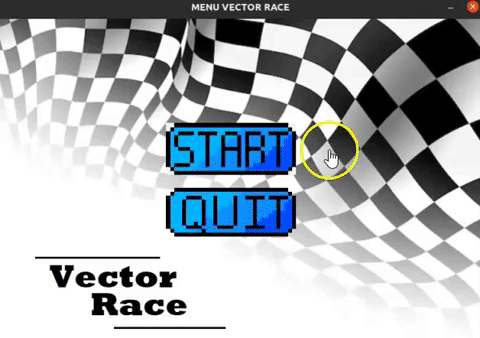

# UC Inteligência Artificial- 22/23
## VECTOR RACE

 The purpose of the developed software is to demonstrate the efficiency of each of the several intelligent search algorithms. In Vector Race we have a car that will have to reach the goal that is represented by the white rectangle. The circuit obstacles are represented in blue and the car in red.
The car may run into one of these obstacles, which will proceed to the previous position if that occurs. Whenever the car collides with a wall, the cost increments by 25, otherwise only by 1.

