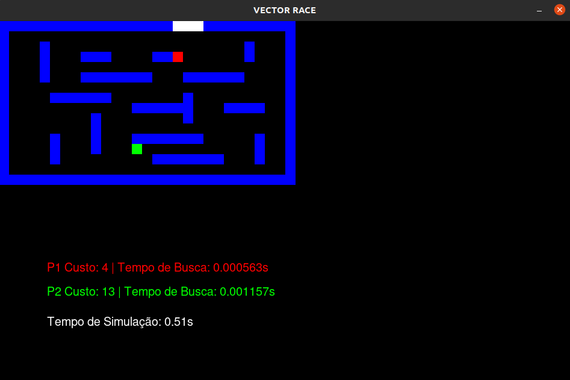
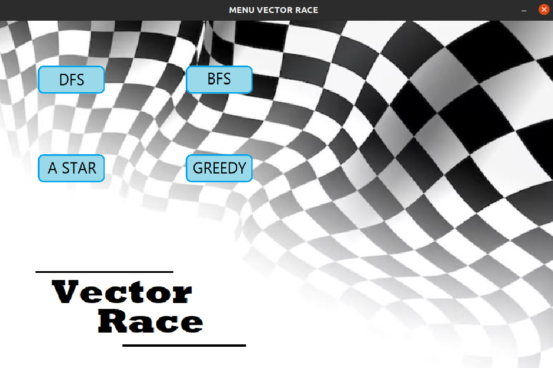

# Vector Race AI Simulator

Vector Race is a simulation project that visualizes different AI pathfinding algorithms competing in a race to solve a maze. The project uses multithreading to run each AI algorithm simultaneously, allowing for a real-time comparison of their efficiency and performance.

---

## 🏁 Features

* **Multiplayer AI Race:** Watch cars competing in a race by using search algorithms to find their path to the finish line.
* **Pathfinding Algorithm Selection:** Choose between several popular algorithms:
    * **DFS (Depth-First Search)**
    * **BFS (Breadth-First Search)**
    * **A\* (A-Star)**
    * **Greedy Best-First Search**
* **Real-time Visualization:** The simulation shows the progress of each player's car and highlights their calculated paths.
* **Performance Metrics:** Displays key metrics for each algorithm, including the **path cost** (number of steps) and **search time** (how long it took to find the path).
* **Dynamic Winner Declaration:** The first player to reach the finish line is declared the winner in real time.
* **Cost:** The search cost will increment by 25 when a collision occurs, otherwise it increments only by 1.

---

## 🚀 Getting Started

### Prerequisites

* Python 3.x
* Pygame library

You can install the necessary library using pip:

```bash
pip install pygame
```
<p> The purpose of the developed software was to demonstrate the efficiency of each of the several intelligent search algorithms. In Vector Race we have a car that will have to reach the goal that is represented by a color rectangle. The circuit obstacles are represented in blue.
The car may run into one of these obstacles, which will proceed to the previous position if that occurs. Whenever the car collides with a wall, the cost increments by 25, otherwise only by 1.</p>




